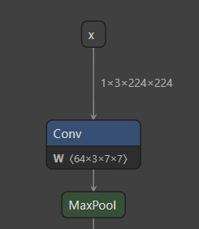
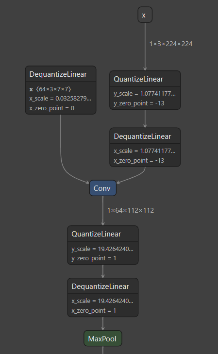
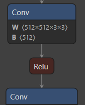
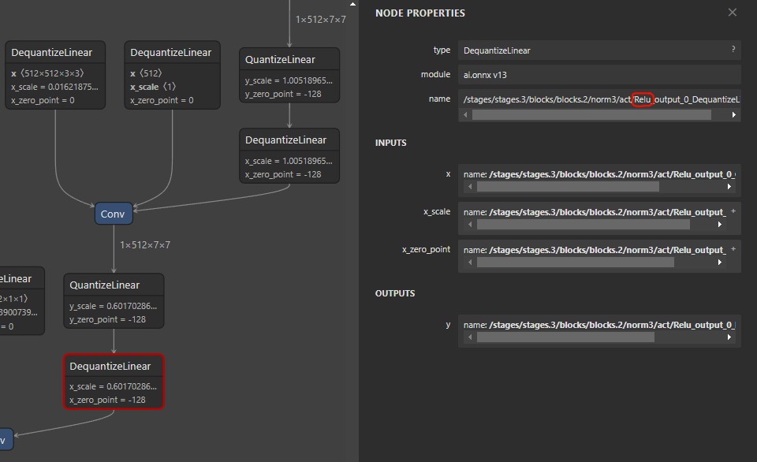

# Initial commit of QDQ support
[QDQ-fromat](https://onnxruntime.ai/docs/performance/model-optimizations/quantization.html#onnx-quantization-representation-format) quantization support. Includes 2 new files for `QuantizeLinear` and `DequantizeLinear`.

I decided to implement QDQ convertion as convertion into **unquantized float-point** torch model, that one can train or/and quantize through torch.ai.qauntization API. There are some reasons for it:
1. Torch has at least 3 different [API](https://pytorch.org/docs/stable/quantization.html) for quantization, each contains static and dynamic version (so we get 6 types of implementation)
2. Training process is difficult for quantized models.

There are some moments about QDQ models:
| float-point layer | corresponding QDQ layer |
| :---------------: | :---------------------: |
|     |         |

1. QuantizeLinear is used in only way -- to quantize input signal.
2. DequantizeLinear can be used in 2 purposes:
   - As initializer for quantized weights/biases/...  
   - As dequantization of input signal.

## QuantizeLinear
Since we want to get unquantized model in the end, we can skip the quantization of the input signal. Then we return the tensor itself without any transformation.

## DequantizeLinear
### As initializer
DequantiseLinear in ONNX is a node, but in practice it behaves more like initializer. Moreover, torch's CNN layers cannot receive weights and biases as layers (like in ONNX), so i added `_qinitializer` property into `OnnxGraph`, that stores dequantized weights and biases for CNN layers. This dict is filled during convertion process. Since the graph is topologically sorted, it is guaranteed that all the initializer-DequantizeLinear-nodes will be traversed **before** corresponding CNNs.

### As dequantization of input signal
This is used for dequantization of quantized input signal.
Since we skip quantization, we could just skip this layers. But sometimes tis layers is fused with activations, so we must handle this as adding activation layer. 

The only activation i implemented is `ReLu` as the most popular activation (ONNX adds `Relu` word into `node.name` during QDQ-quantization).

| float-point layer | corresponding QDQ layer |
| :---------------: | :---------------------: |
|   |         |

