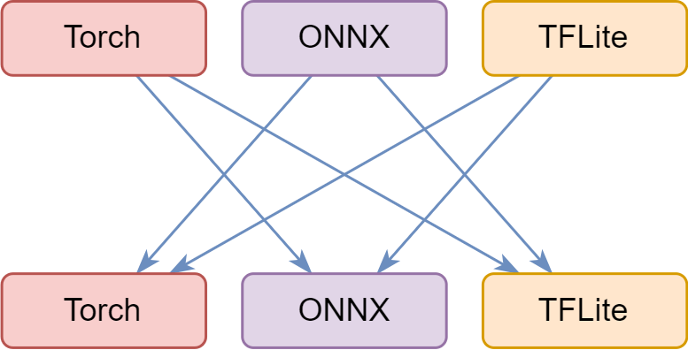
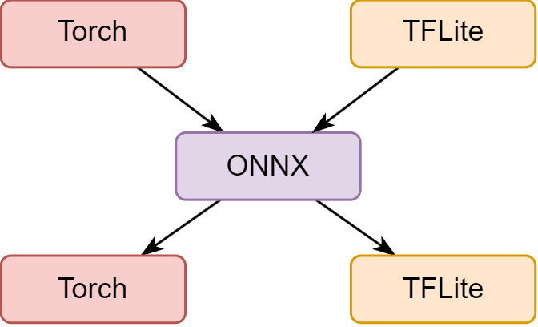
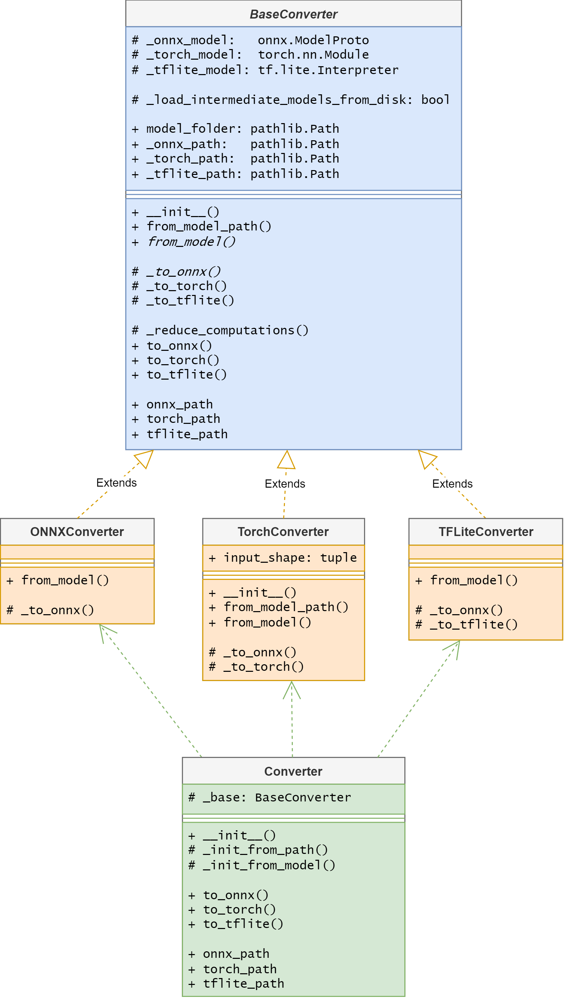

# Machine Learning Model Converter API
- [Machine Learning Model Converter API](#machine-learning-model-converter-api)
  - [Basic idea](#basic-idea)
  - [Class hierarchy](#class-hierarchy)
    - [BaseConverter](#baseconverter)
    - [BaseConverter inheritance](#baseconverter-inheritance)
    - [Converter](#converter)
  - [Use-cases](#use-cases)
  - [TODO](#todo)
    - [Converter](#converter-1)
    - [Mul](#mul)
    - [Trainer](#trainer)


## Basic idea
Конвертер любой модельки в любую модельку (в рамках `ONNX`, `Torch`, `TFLite`) 

Идея конвертирования следующая -- конвертировать любую модельку на входе в ONNX, а дальше конвертировать из ONNX в любую желаемую модельку. Сравнение пайплайнов "напрямую" и "через onnx" ниже:
|      напрямую       |    через `ONNX`     |
| :-----------------: | :-----------------: |
|       |      |
| Реализация 6 связей | Реализация 4 связей |

## Class hierarchy
Иерархия классов выглядит следующим образом (я не стал указывать, аргументы функций и тип возврата, ибо было бы громоздко -- чекайте код для этого):

 <p style="text-align:center;"> <a href="https://app.diagrams.net/#G1A8NmdUEWuwNWmuKJzprfxX9Fs3nFOrkw#%7B%22pageId%22%3A%22ZHdpkJ9Vi8-lnTqTLBOF%22%7D" > </a> </p>
    <!-- (max-width: 300px) 100vw
    max-width="500px"
    width="50%" -->
<!-- []() -->


### BaseConverter
`BaseConverter` -- это абстрактный класс, в котором есть поля, соответствующие всем моделькам и их путям. Содержит реализации конвертирования в `TFLite` и `Torch` по умолчанию (из `ONNX`), но заставляет потомков переопределить конвертирование в `ONNX`. Важный момент: наследник переопределяет лишь **защищённые** методы конвертирования (начинающиеся с нижнего подчёркивания). В то время, как пользователь вызывает **публичные** методы, которые, в зависимости от условий делают следующее:
- возвращают уже сконвертированную модельку, если она уже была сконвертирована ранее
- загружают модель с диска, если пользователь указал `load_intermediate_models_from_disk` = True (и если эта модель действительно лежит на диске)
- вызывает соответствующий защищённый метод конвертирования `_to_...()`, если ни одно из условий не выполнилось

Наследнику необходимо переопределить:
- `_to_onnx()`: метод конвертирования в onnx, который сохраняет новую модель на диске и возвращает её в виде `onnx.ModelProto`
- `_to_...()`: метод конвертирования в свою же модель
- `from_model()`: конструктор от модели -- необходимо инициализировать соответствующее `_..._model` поле!

### BaseConverter inheritance
Наследники -- это классы `ONNXConverter`, `TorchConverter`, `TFLiteConverter`. Название каждого из этих классов отражает тип **входной** модели.

В реализации `TorchConverter` необходимо определить размер по умолчанию для модели (это нужно, так как onnx и tflite имеют статически вычисляемый граф, а torch -- динамически вычисляемый), поэтому приходится переопределять ещё и конструкторы `__init__` и `from_model_path`.

Реализация `TFLiteConverter` не предполагает конструирование от модели (только от пути). Это связано с трудностями работы с `tf.lite.Interpreter`, который не даёт сохранить модель на диске (помимо этого, либы конвертирования не принимают tflite в виде модели -- только путь ~~самурая~~)

### Converter
Класс `Converter` содержит в себе единственное поле -- `base`, которое инициализируется одним из наследников `BaseConverter`. Инициализация происходит автоматически на основе типа поданной модели, или расширения в переданном имени. То есть, пользователю **не нужно** вызывать from_model или from_path, всё, что требуется -- это передать аргументы `model` и/или `model_path`.

## Use-cases
Опишем предполагаемый вариант использования `Converter` в рамках проекта, в котором надо:
- конвертировать любую модельку во что-то, что можно натренировать 
- натренировать на своём датасете
- конвертировать к обратному виду

Предлагается юзать 2 конвертера:
1. Для конвертирования в `torch` для тренировки
2. Для конвертирования из `torch` обратно 

Тогда код для TFLite-модельки будет выглядеть примерно так:
```py
    # создаём конвертер из нашей tflite модельки
    converter = Converter(
        model_path='model.flite',
        load_intermediate_models_from_disk=False,
    )

    # тренируем торч-модельку (реализовано лишь для задачи классификации)
    trainer = Trainer(
        model=converter.to_torch(),
        train_dataloader=train_dataloader,
        valid_dataloader=valid_dataloader,
        test_dataloader=test_dataloader,
    )
    trainer.train(epoch=20)
    
    # создаём конвертер из торча и конвертируем обратно в tflite
    input_shape = OnnxIO(converter.to_onnx()).input_shape
    converter = Converter(
        model=trainer.best_model,
        input_shape=input_shape,
        load_intermediate_models_from_disk=False,
    )
    converter.to_tflite()
```
Процессы конвертирования логируются в `logs/converter.log`.
Есть примерчик в [test_convertion.py](../test/test_convertion.py)

## TODO
### Converter
1. Сам конвертер может быть с багами -- я его не успел нормально оттестировать.
2. Возможно, класс Converter должен хранить поле, которое бы отвечало за тип модели. Тогда будет удобно конвертировать модель после тренировки к обратному виду, вызывая какой-нибудь метод `to_origin_type()` и не работая напрямую с `to_tflite()`, `to_torch()` или `to_onnx()`.
3. Неудобно масштабировать -- если кто-то захочет добавить условный `keras`, то придётся добавлять его и в `BaseConverter`, и делать нового `наследника`, и дополнять `Converter`
4. Имеет смысл пересмотреть реализацию конструкторов -- сделать так, чтобы метод `to_onnx()`вызывался в конструкторе, раз мы всё равно от него пляшем.
### Mul
Оказалось, что моё решение проблемы слоя `Mul` либы `onnx2tf` некорректное (оно работает для YOLO, но руинит drone.tflite). Придётся всё же вернуться к Reshape -- весь трэйс проблемы описан в тайге (начиная с `20.03` и акцентируя внимание на `17.04`)
### Trainer
Я написал класс тренировщика лишь для задачи классификации (лежит в ...). Но нам нужен тренировщик для Object Detection. Скорее всего, придётся тоже делать BaseTrainer и от него наследоваться для различных задач ComputerVision (можно подсмотреть, как это сделано у [ultralytics](https://github.com/ultralytics/ultralytics/tree/main/ultralytics/engine))